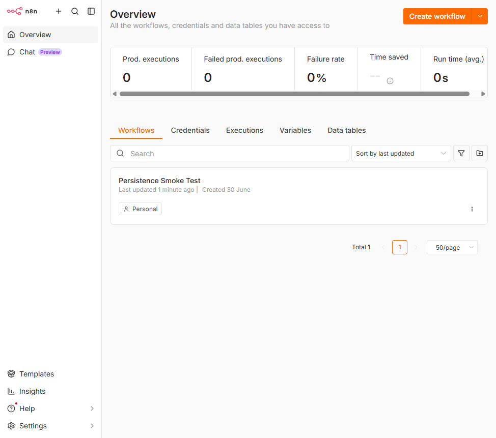
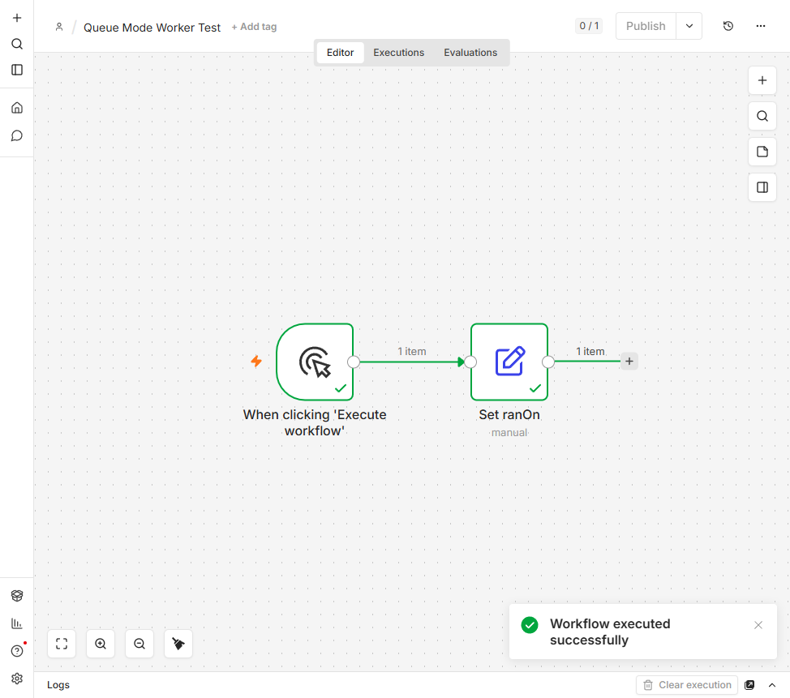

# Self-Hosting n8n: Docker Compose and Kubernetes (Queue Mode)

[](https://github.com/SFX-TECH/n8n-selfhost-k8s/actions/workflows/validate.yml)

A hands-on reference for running [n8n](https://n8n.io) yourself, two ways:

1. **Docker Compose** for a single host: n8n + Postgres + Redis.
2. **Kubernetes** for production-style scaling: n8n in **queue mode** with a main
   process, a pool of autoscaled worker pods, Redis as the job queue, and
   Postgres for durable state.

The repo is intentionally generic and secret-free. It exists to show the moving
parts of a real n8n self-host and how the same stack grows from one container to
a horizontally scaled Kubernetes deployment.

> Built and verified against **n8n 2.27.5**, Postgres 16, and Redis 7, on Docker
> Desktop's built-in Kubernetes (v1.34). Docs were pulled from the current
> official n8n documentation rather than from memory.

---

## What this demonstrates

- Multi-service Docker Compose with health checks and ordered startup.
- Durable state: workflows and credentials live in Postgres and survive a full
  container teardown and recreate.
- Queue mode on Kubernetes: a main/worker split, Redis as the broker, an
  initContainer ordering gate so workers do not race the main on database
  migrations, health probes wired to n8n's `/healthz`, and a HorizontalPodAutoscaler.
- Proof, not just config: a workflow executed and the worker pod logs show the
  worker picking up the job.
- Secret hygiene: the encryption key and database password are generated locally
  and never committed. Only `.example` files are in git.

---

## Architecture

### Docker Compose (single host)

```
                       Host: localhost
   browser  ->  :5678  +-----------------------------------------+
                       |  Docker network: n8n-net                |
                       |                                         |
                       |   +-----------+      +---------------+  |
                       |   |   n8n     |----->|   postgres    |  |
                       |   | (main UI) |      | volume:pg_data|  |
                       |   |  :5678    |      |   :5432       |  |
                       |   +-----------+      +---------------+  |
                       |         |                              |
                       |         v                              |
                       |   +-----------+                        |
                       |   |  redis    |  healthy, ready for    |
                       |   |  :6379    |  queue mode            |
                       |   +-----------+                        |
                       |                                         |
                       |  named volumes: n8n_data, pg_data       |
                       +-----------------------------------------+
```

n8n runs in the default (regular) execution mode here. Redis is included and
health checked so the topology matches the Kubernetes phase, and Compose can be
flipped into queue mode with one flag (see [Queue mode in Compose](#optional-queue-mode-in-compose)).

### Kubernetes (queue mode)

```
                         Kubernetes namespace: n8n

   browser
     |  http://localhost:30678   (NodePort 30678)
     v
  +--------------------+        1. enqueue job       +-------------------+
  |  n8n-main          |  ------------------------>  |   redis           |
  |  Deployment (1)    |                             |   Deployment (1)  |
  |  EXECUTIONS_MODE=  |                             |   Service :6379   |
  |     queue          |                             +-------------------+
  |  Service :5678     |                                      |
  |  PVC /home/node    |                            2. worker pulls job
  +--------------------+                                      v
     ^      |                                   +-------------------------------+
     |      | read/write                        |  n8n-worker  (Deployment)     |
     |      v                                    |  args: n8n worker             |
  +--------------------+   3. worker writes      |  +---------+  +---------+     |
  |  postgres          |      results back       |  | worker1 |  | worker2 | ... |
  |  StatefulSet (1)   |  <--------------------   |  +---------+  +---------+     |
  |  PVC /var/lib/pg   |                          |  scaled by HorizontalPodAutoscaler |
  |  Service :5432     |                          +-------------------------------+
  +--------------------+
```

The main process owns the UI, REST API, webhooks, and schedule triggers. It does
not run executions itself; it enqueues them to Redis. Worker pods pull jobs off
Redis, run them, and write results to Postgres. Scaling executions means scaling
worker pods.

---

## Repo layout

```
.
├── docker-compose.yml          # n8n + Postgres + Redis (Phase 1)
├── .env.example                # every variable documented; copy to .env
├── k8s/
│   ├── 00-namespace.yaml
│   ├── 01-configmap.yaml       # non-secret config (DB host, queue, modes, tz)
│   ├── 02-secret.example.yaml  # template only; real Secret is generated locally
│   ├── 03-postgres.yaml        # StatefulSet + headless Service + PVC
│   ├── 04-redis.yaml           # Deployment + Service
│   ├── 05-n8n-main.yaml        # main Deployment (queue mode) + Service + PVC
│   ├── 06-n8n-worker.yaml      # worker Deployment (n8n worker) + init gate
│   ├── 07-n8n-worker-hpa.yaml  # HorizontalPodAutoscaler
│   ├── 08-n8n-nodeport.yaml    # NodePort to reach the UI
│   ├── 09-ingress.yaml         # optional Ingress (needs ingress-nginx)
│   ├── kustomization.yaml      # kubectl apply -k k8s/
│   └── generate-secret.sh      # writes git-ignored 02-secret.yaml
├── docs/img/                   # screenshots used in this README
├── NOTES.md                    # engineering log and design decisions
└── README.md
```

---

## What is queue mode, and why workers + Redis?

By default n8n runs in **regular mode**: a single process handles the UI, the
API, triggers, and it also runs every workflow execution. That is fine for one
host and light load, but executions and the UI compete for the same CPU, and you
can only scale by making that one process bigger.

**Queue mode** splits the work:

- The **main** process handles the UI, the REST API, webhooks, and schedule
  triggers. When something needs to run, it does not execute it. It puts a job on
  a queue.
- **Redis** is that queue (n8n uses the Bull library on top of Redis). It is the
  hand-off point between the main process and the workers.
- **Worker** processes (`n8n worker`) pull jobs off Redis, execute the workflow,
  write the results to Postgres, and report back.

Why this matters:

- **Scale executions independently of the UI.** Heavy workflow load is absorbed by
  adding worker pods, while the UI stays responsive.
- **Horizontal scaling.** Workers are stateless (all state is in Postgres), so you
  can run many of them and add or remove them on demand. That is exactly what the
  HorizontalPodAutoscaler does here.
- **Resilience.** If a worker dies mid-job, the job stays on the queue and another
  worker can pick it up.

Two requirements that trip people up, both handled in this repo:

- The `N8N_ENCRYPTION_KEY` must be **identical** on the main process and every
  worker, or workers cannot decrypt stored credentials. Here every pod reads the
  same Kubernetes Secret, so this is automatic.
- On a fresh database, the main process must run schema **migrations before** any
  worker starts. If they race, the migration state is corrupted. The worker pods
  have an initContainer that waits for the main `/healthz` (which only passes
  after migrations finish) before starting.

---

## Quickstart: Docker Compose

**Prerequisites:** Docker Desktop (or Docker Engine) with Compose v2.

```bash
# 1. Create your local secrets file from the template
cp .env.example .env

# 2. Generate real secrets and put them in .env
#    N8N_ENCRYPTION_KEY:  openssl rand -hex 32
#    POSTGRES_PASSWORD:   openssl rand -hex 16
#    (edit .env and paste the values)

# 3. Start the stack
docker compose up -d

# 4. Watch it come up healthy
docker compose ps
```

Then open **http://localhost:5678** and create the owner account on first launch
(email, name, password). n8n removed the old `N8N_BASIC_AUTH_*` variables; access
is now controlled by this built-in owner account and user management. You can
optionally pre-provision the owner from the environment instead (see the
commented block at the bottom of `.env.example`).

Useful commands:

```bash
docker compose logs -f n8n                  # follow n8n logs
docker compose exec redis redis-cli ping    # -> PONG
docker compose down                         # stop + remove containers (KEEPS data)
docker compose down -v                      # ALSO delete volumes (wipes data)
```

### Proving persistence (Postgres)

The point of using Postgres is that workflows and credentials do not live inside
the n8n container. To prove it, create a workflow, destroy the containers,
recreate them, and confirm the workflow is still there.

```bash
docker compose exec -T postgres psql -U n8n -d n8n -c "SELECT id, name FROM workflow_entity;"
docker compose down        # containers removed, named volumes kept (no -v)
docker compose up -d
docker compose exec -T postgres psql -U n8n -d n8n -c "SELECT id, name FROM workflow_entity;"
```

The workflow (and the owner account) survive the recreate because they live in
the `pg_data` volume, not the container:



### Optional: queue mode in Compose

Compose can also run queue mode with a dedicated worker, mirroring Kubernetes.
Set `EXECUTIONS_MODE=queue` in `.env`, then start with the `queue` profile:

```bash
docker compose --profile queue up -d
docker compose logs -f n8n-worker
```

---

## Quickstart: Kubernetes (queue mode)

**Prerequisites:** a Kubernetes cluster and `kubectl`. This was verified on Docker
Desktop's built-in Kubernetes. Enable it in Docker Desktop under
Settings -> Kubernetes -> Enable Kubernetes -> Apply and Restart, then confirm:

```bash
kubectl config current-context     # should print: docker-desktop
```

Deploy:

```bash
# 1. Generate the Secret locally (writes git-ignored k8s/02-secret.yaml)
./k8s/generate-secret.sh

# 2. Apply the whole stack
kubectl apply -k k8s/

# 3. Wait for it to come up, in order (postgres -> main migrates -> workers)
kubectl wait --for=condition=ready pod -l app=postgres   -n n8n --timeout=120s
kubectl wait --for=condition=ready pod -l app=n8n-main   -n n8n --timeout=240s
kubectl wait --for=condition=ready pod -l app=n8n-worker -n n8n --timeout=180s

# 4. Look at what is running
kubectl get pods -n n8n -o wide
kubectl get svc,hpa -n n8n
```

Open **http://localhost:30678** (the NodePort) and create the owner account.

```bash
# Follow logs
kubectl logs -n n8n deploy/n8n-main -f
kubectl logs -n n8n -l app=n8n-worker --prefix -f
```

### Proving a worker ran the execution

The ConfigMap sets `OFFLOAD_MANUAL_EXECUTIONS_TO_WORKERS=true`, so even a manual
"Execute workflow" click is sent to a worker. Create a small workflow, run it,
then read the worker logs:

```bash
kubectl logs -n n8n -l app=n8n-worker --prefix | grep -i "execution"
```

Observed output (the worker pod picked up and finished the job):

```
[pod/n8n-worker-6957c787cd-jcxn9/n8n-worker] Worker started execution 1 (job 1)
[pod/n8n-worker-6957c787cd-jcxn9/n8n-worker] Worker finished execution 1 (job 1)
```



### Scaling the workers

Scale manually:

```bash
kubectl scale deployment n8n-worker -n n8n --replicas=4
kubectl rollout status deployment n8n-worker -n n8n
kubectl get pods -n n8n -l app=n8n-worker
```

Or let the HorizontalPodAutoscaler do it (min 2, max 5, target 50 percent CPU).
The HPA needs metrics-server, which Docker Desktop does not ship. Install it and
patch it for Docker Desktop's self-signed kubelet certificate:

```bash
kubectl apply -f https://github.com/kubernetes-sigs/metrics-server/releases/latest/download/components.yaml
kubectl patch deployment metrics-server -n kube-system --type='json' \
  -p='[{"op":"add","path":"/spec/template/spec/containers/0/args/-","value":"--kubelet-insecure-tls"}]'
kubectl rollout status deployment metrics-server -n kube-system

# Then the HPA reads live CPU:
kubectl get hpa -n n8n
kubectl top pods -n n8n
```

### Optional: Ingress instead of NodePort

The NodePort (08) is the default, zero-dependency way in. To use an Ingress
instead, install ingress-nginx, then apply `k8s/09-ingress.yaml` and browse to
http://n8n.localhost:

```bash
kubectl apply -f https://raw.githubusercontent.com/kubernetes/ingress-nginx/main/deploy/static/provider/cloud/deploy.yaml
kubectl apply -f k8s/09-ingress.yaml
```

### Teardown

```bash
kubectl delete namespace n8n        # removes everything, including PVC data
```

---

## Troubleshooting

- **Worker pods CrashLoopBackOff with "relation ... already exists".** The main and
  workers raced the initial migrations. This repo prevents it with the worker
  initContainer that waits for the main `/healthz`. If you hit it on a custom
  setup, wipe the database and let the main start first.
- **n8n-main restarts once on first boot with "getaddrinfo EAI_AGAIN postgres".**
  Postgres DNS was not resolvable yet. The main has a wait-for-postgres
  initContainer to avoid this.
- **HPA shows `cpu: <unknown>/50%`.** metrics-server is not installed or not ready.
  Install and patch it as shown above, then wait one poll cycle.
- **Cannot log in over plain HTTP.** n8n refuses to set the auth cookie over HTTP on
  a non-localhost host. The ConfigMap sets `N8N_SECURE_COOKIE=false` for the
  NodePort demo. Use HTTPS in production instead.
- **`N8N_RUNNERS_ENABLED` deprecation log.** n8n 2.x has task runners on by default,
  so this variable is no longer set here.

---

## Security and secrets

- `.env` and the rendered Kubernetes Secret (`k8s/02-secret.yaml`) are git-ignored.
  Only `.example` files are committed. Run `git status` before committing to confirm.
- The `N8N_ENCRYPTION_KEY` must be set before first start and then kept constant.
  In queue mode it must be identical on the main process and every worker, which
  is automatic here because they all read the same Secret.
- No client data and no real credentials are in this repo. All names and demo
  values are generic.

---

## License

MIT. See [LICENSE](LICENSE).
