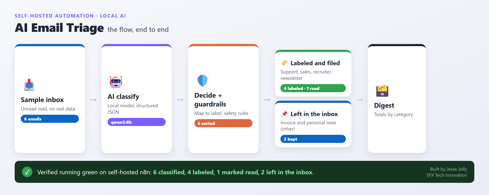

# Example: AI Email Triage (local model)

A runnable n8n workflow that sorts an inbox the way a person would triage their
mail by hand: read each message, decide what it is (a support request, a sales
lead, a recruiter, a newsletter, or something personal), and file it under the
right label. Newsletters get marked read so they stop cluttering the inbox.
Anything it is unsure about is left alone for a human. It runs end to end on the
self-hosted n8n in this repo using a local AI model, so no email content leaves
the machine.



This is the generic, data-free version of a private inbox assistant. The sample
inbox here is fake. To point it at a real mailbox you swap one node, as described
in "Making it real" below.

## What it does, in plain English

1. A batch of unread emails arrives (this demo uses six fake sample emails: a
   support request, a sales inquiry, a recruiter, a newsletter, a billing invoice,
   and a personal note).
2. A local AI model reads the sender, subject, and preview of each one and returns
   a structured rating: the category, a confidence from 0 to 1, and a short reason.
3. A decision step applies two safety guardrails on top of the model, maps the
   category to a label, and marks newsletters to be read.
4. A branch routes each email: the ones that earned a label go down a "label it"
   path, and the rest go down a "leave in inbox" path for review.
5. Both paths merge, and a final step prints a digest: totals by category, how many
   would be labeled, and how many would be marked read.

## How it is built (the nodes)

| Step | Node | Purpose |
|---|---|---|
| 1 | Manual Trigger | One click to run the demo with a clean green result |
| 2 | Code: Generate sample inbox | Returns six fake emails, no real data |
| 3 | HTTP Request: AI classify | Calls a local Ollama model for structured JSON |
| 4 | Code: Decide and route | Applies guardrails, maps category to label, sets the action |
| 5 | IF: Label it? | Branches on whether the email earned a label |
| 6 | Set: Apply label (demo) | Stands in for the Gmail "add label" step |
| 7 | Set: Leave in inbox (demo) | Marks the message as left for review |
| 8 | Merge routes | Recombines both branches |
| 9 | Code: Summary digest | Counts by category and totals the actions |

## The AI step

The classification calls a local model through Ollama's OpenAI-style chat API at
`http://host.docker.internal:11434/api/chat`, using Ollama structured outputs (a
JSON schema) so the model returns clean, schema-conforming JSON every time. The
demo was verified with the `qwen3:8b` model. Any Ollama model that follows
instructions works; swap the `model` field in the request.

`host.docker.internal` is how a container or pod reaches a service running on the
host. It resolves from both the Docker Compose container and the Kubernetes
worker pod on Docker Desktop.

## The safety guardrails

A small local model is fast and private, but it will occasionally miss a nuance.
Rather than trust the raw label, the Decide node enforces two deterministic rules,
so a wrong guess never takes the wrong action:

1. **Transactional mail is never a newsletter.** If the model tags an email
   `newsletter` but the subject looks like an invoice, receipt, payment, purchase,
   verification code, sign in, password, statement, or order, it is downgraded to
   `other`. That means account and billing mail is never auto marked read.
2. **Low confidence falls back to a safe bucket.** If the model's confidence is
   below 0.5, the email is routed to `other` and left in the inbox for a human to
   look at, instead of being labeled on a guess.

In the sample run the model already sorts these correctly, so the guardrails sit
quietly in the background. They earn their place on the messages a small model gets
wrong, which is exactly when you do not want it acting on a guess.

This is the core idea worth stealing: let the model propose, but let plain code
with clear rules decide what actually happens to someone's mailbox.

## How to import and run it

1. Bring up the self-hosted n8n from the repo root (see the main README), either
   the Docker Compose stack or the Kubernetes stack.
2. Make sure a local model is reachable. With [Ollama](https://ollama.com)
   installed: `ollama pull qwen3:8b`.
3. In the n8n UI, open Workflows, choose Import from File, and select
   `email-triage.workflow.json`.
4. Open the workflow and click Execute workflow. Every node should turn green. In a
   typical run with `qwen3:8b`, four emails earn a label (support, sales lead,
   recruiter, and the newsletter, which is also marked read) and two are left in the
   inbox as `other`: the billing invoice and the personal note. The Summary digest
   node prints the totals, for example `Would label 4, would mark read 1`.

In queue mode on Kubernetes, the execution is picked up by a worker pod. You can
confirm it in the worker logs:

```bash
kubectl logs -n n8n -l app=n8n-worker --prefix | grep -i "execution"
```

## Making it real (connect a mailbox)

The demo keeps everything fake and self-contained. To run it against a real Gmail
inbox on your own private n8n, you change three things and add a credential:

1. Replace **Generate sample inbox** with a **Gmail** node (resource Message,
   operation Get Many) that returns unread inbox mail. Feed its output into the
   classify step, using the message `From`, `Subject`, and `snippet` fields.
2. After the **Apply label** path, add a **Gmail** node (operation Add Labels) that
   applies the mapped label to the message id.
3. For newsletters, add a **Gmail** node (operation Mark as Read).
4. Add a **Schedule Trigger** (for example every 30 minutes) alongside the Manual
   Trigger so it keeps the inbox sorted on its own, then publish the workflow.

Because the AI runs locally, the real version still sends no email content to any
outside service, and there are no external API keys. The only credential needed is
your own Gmail OAuth client for the mailbox actions.

## Notes

- All sender addresses use the `.example` domain and all content is invented. There
  are no real people, addresses, or secrets in this workflow JSON.
- This is a demonstration of the pattern. The private version behind it keeps the
  same shape: local model classifies, deterministic guardrails decide, and only
  reversible actions (add a label, mark read) ever touch the mailbox. Nothing is
  deleted or archived.
