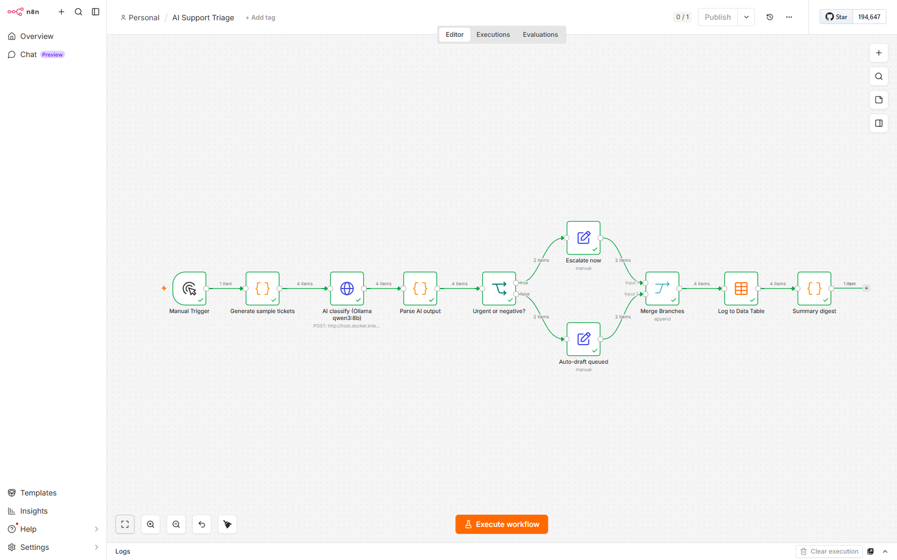

# Example: AI Support Triage

A real, runnable n8n workflow that does what a support coordinator does by hand
all day: read each incoming message, decide how urgent it is and who should
handle it, escalate the ones that cannot wait, draft replies for the rest, and
keep a log. It runs end to end on the self-hosted n8n in this repo, using a local
AI model. No data leaves the machine.



## What it does, in plain English

1. A batch of support messages comes in (this demo uses four fake sample tickets:
   a billing problem, an angry churn-risk customer, a feature request, and a
   how-to question).
2. A local AI model reads each one and returns a structured rating: the topic,
   the urgency (low, medium, high), the customer mood, the team that should
   handle it, and a drafted first reply.
3. A decision step routes each ticket. Urgent or unhappy tickets (high urgency or
   a negative mood) go to an "escalate now" path. Everything else goes to an
   "auto-draft queued" path for a quick human review.
4. Both paths merge, and every triaged ticket is written to a built-in n8n Data
   Table as a running triage log.
5. A final step produces a digest: totals by urgency and by team.

## How it is built (the nodes)

| Step | Node | Purpose |
|---|---|---|
| 1 | Manual Trigger | One click to run the demo with a clean green result |
| 2 | Code: Generate sample tickets | Returns four fake tickets, no real data |
| 3 | HTTP Request: AI classify | Calls a local Ollama model for structured JSON |
| 4 | Code: Parse AI output | Merges the AI fields back with the ticket |
| 5 | IF: Urgent or negative? | Branches on urgency high OR sentiment negative |
| 6 | Set: Escalate now | Tags the urgent path |
| 7 | Set: Auto-draft queued | Tags the routine path |
| 8 | Merge | Recombines both branches |
| 9 | Data Table: Log to Data Table | Writes each ticket to the triage log |
| 10 | Code: Summary digest | Counts by urgency and team |

## The AI step

The classification calls a local model through Ollama's OpenAI-style chat API at
`http://host.docker.internal:11434/api/chat`, using Ollama structured outputs (a
JSON schema) so the model returns clean, schema-conforming JSON every time. The
demo was verified with the `qwen3:8b` model. Any Ollama model that follows
instructions works; swap the `model` field in the request.

`host.docker.internal` is how a container or pod reaches a service running on the
host. It resolves from both the Docker Compose container and the Kubernetes
worker pod on Docker Desktop.

## How to import and run it

1. Bring up the self-hosted n8n from the repo root (see the main README), either
   the Docker Compose stack or the Kubernetes stack.
2. Make sure a local model is reachable. With [Ollama](https://ollama.com)
   installed: `ollama pull qwen3:8b`.
3. Create a Data Table named `support_triage_log` with these text columns:
   `ticket_id, subject, category, urgency, sentiment, suggested_team, route,
   status, draft_reply`. The Data Table node in this workflow matches that table
   by name.
4. In the n8n UI, open Workflows, choose Import from File, and select
   `support-triage.workflow.json`.
5. Open the workflow and click Execute workflow. Every node should turn green,
   four rows should appear in the Data Table, and the Summary digest node should
   output the totals.

In queue mode on Kubernetes, the execution is picked up by a worker pod. You can
confirm it in the worker logs:

```bash
kubectl logs -n n8n -l app=n8n-worker --prefix | grep -i "execution"
```

## Notes

- All ticket content is fake and generic. There are no real customers, names, or
  secrets in this workflow JSON.
- This is a demonstration of the pattern. For production you would replace the
  sample-tickets node with a real trigger (a webhook, an email trigger, or a help
  desk integration) and the escalate path with a real notification or ticket
  update.
